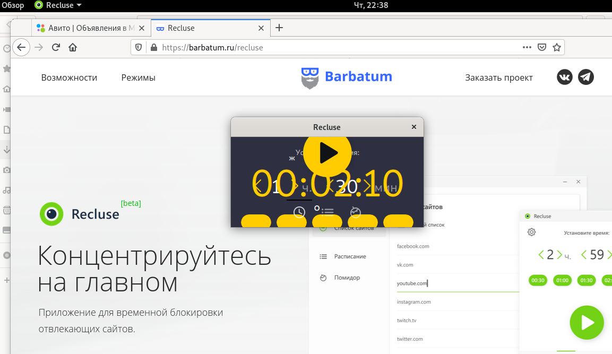
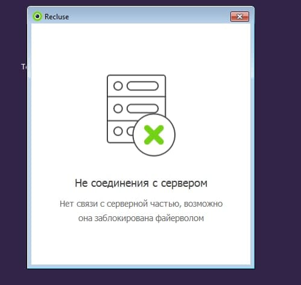
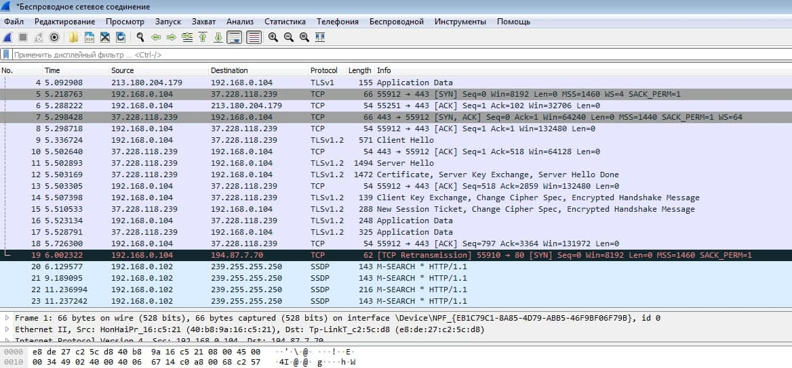

## Баг-репорт 1
Заголовок: Не появляется справа scroll bar в вкладке 'Список сайтов' при добавление больше 8 полей ввода

Подробное описание: При добавление в вкладке 'Список сайтов' больше 8 строк не появляется справа scroll bar.
Это может привести к тому, что пользователь не адекватно воспримет список сайтов, т.к. их количество не понятно.

Шаги воспроизведения:
1. Нажать на кнопку  '+' больше 8 раз
2.  В каждую строку поиска вставить корректные адреса сайтов и нажать кнопку "Сохранить"

Фактический результат:
Scroll bar справа не появляется.

Ожидаемый результат:
При добавление списка сайтов больше 8 строк справа должен появиться scroll bar. 

Серьезность: Trivial

Приоритет: Low

Окружение: !!!!!!!!!!!!!!!!!!!!!!!!!!!!!

## Баг-репорт 2
Заголовок: Не появляется справа scroll bar в вкладке 'Расписание' при добавление больше 8 вариантов расписаний

Подробное описание: При добавление в вкладке 'Расписание' больше 8 строк не появляется справа scroll bar.
Это может привести к тому, что пользователь не адекватно воспримет список расписаний, т.к. их количество не понятно и полностью не отображается.

Шаги воспроизведения:
1. Нажать на кнопку  '+'  больше 8 раз
2.  Заполнить каждое поле времени и дня недели  и нажать кнопку "Сохранить"

Фактический результат:
Scroll bar справа не появляется.

Ожидаемый результат:
При добавление больше 8 строк справа должен появиться scroll bar. 

Серьезность: Trivial

Приоритет: Low

Окружение: !!!!!!!!!!!!!!!!!!!!!!!!!!!!!!!!!!!!!!!!

### Баг-репорт 3
Заголовок: Некорректное отображение окна с информацией после запуска приложения
в ОС Linux
Подробное описание:
Элементы интерфейса GUI окна инофрмации после запуска приложения отображаются некорректно

Шаги воспроизведения:
1. Заполнить список сайтов и запустить приложение (см.Тест-кейс 'Настройки-Список сайтов-Добавление')

Фактический результат:
Окно информации после запуска приложения отображается нечитабельно.

Ожидаемый результат:
Окно информации после запуска приложения отображается корректно.

Серьезность: Minor!!!!!!!!!!!!!

Приоритет: Normal

Окружение: 
Операционная система-Linux;
Версия ОС-Debian 10 (GNOME)

Прикрепленные файлы:

## Баг-репорт
Заголовок: Отсутствие соединения с сервером в ОС Windows при запуске приложения
Подробное описание:
По факту запуска приложения не происходит его фактического старта из-за отсутсвия подключения к серверу, однако, процесс `recluse-server` запущен и сетевой handshake произошел.

Шаги воспроизведения:
1. Запустить приложение

Фактический результат:
Окно с ошибкой "Нет соединения с сервером".

Ожидаемый результат:
Приложение готово к использованию.

Серьезность: Critical

Приоритет: Normal

Окружение: 
Операционная система - Windows 7 x86-64;

Прикрепленные файлы:

## Замечания по удобству пользования:
1. Не хватает возможности самостоятельно задавать время на преждевременную разблокировку (например, требуется добавить сайт в Белый список - зачем ждать 3 минуты)
2. Не хватает всплывающих подсказок при наведении курсора на кнопки

